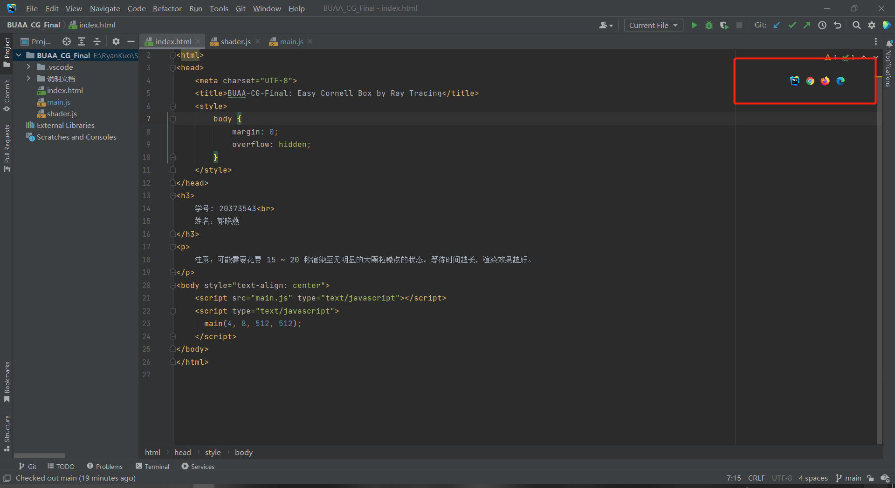
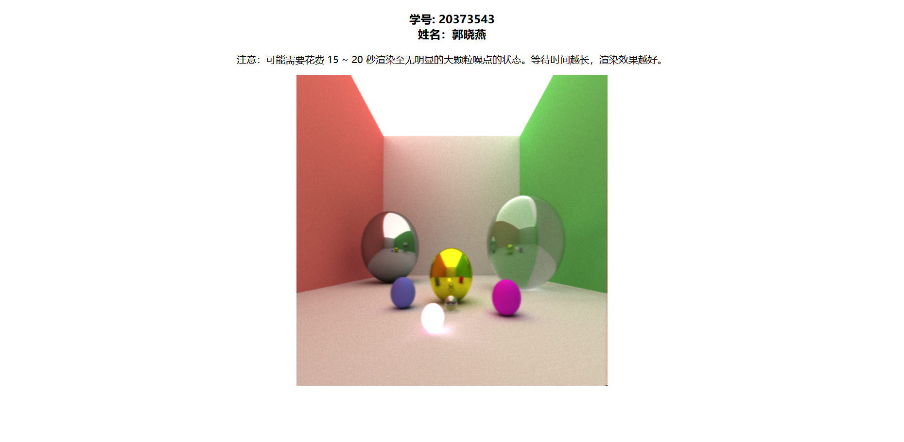

# BUAA_CG_Final

## 任务介绍

本作业实现的是编程实践大作业中的自选任务四，完成了如下的具体要求：

- 实现光线跟踪算法
- 通过底层算法实现计算光线交点来绘制场景
- 场景中图元数量不少于 5 个
- 能够实现自然软阴影效果
- 能够实现一个不锈钢表面材质物体反射周围环境的基本效果

## 运行方法

本作业基于 Web 实现，因此只需双击本目录下的 `index.html` 文件，即可自动跳转到浏览器，在所展示的网页中看到作业的运行结果。

经测试，能够在 Edge / Google Chrome / FireFox 浏览器上正常运行。（优先使用 FireFox）

如果直接点击 html 文件无法显示渲染的画布，可能是浏览器不支持 Web Worker 访问本地 js 脚本的原因。此时有两个解决方案：

- 如果本地有 Visual Studio Code，使用它打开本项目，然后在插件商店搜索安装 **Live Server** 插件。安装后右键单击 html 文件，选择 `Open With Live Server` 选项，即可正常浏览；
- 如果本地有 WebStorm，使用它打开本项目，在 html 文件处任意选择一个选项打开网页文件即可正常浏览；

## 代码结构

```
├─.idea
└─shader.js
└─index.html
└─main.js
```

其中：

- index.html: 用于编辑展示网页的基本框架
- shader.js: 项目核心着色器代码，内含光线跟踪的底层算法
- main.js: 通过调用 Web API（canvas 2d），将着色器文件中的渲染求解结果绘制到网页上

## 实现简述

考虑到调用 Web API 绘制图像的过程比较机械，因此只讲述项目的核心实现 `shader.js` 部分。

### 预备工作

由于 JS 数据结构和 canvas 2d API 等的限制，在实现具体的光线跟踪算法之前需要先手写一些方法，辅助后续工作的进行。笔者在此完成了用于实现类似 cpp 中“衍生类”功能的方法 `extend`（可以扩展参数列表），还有三维向量数据结构 `vec3`。

```js
    //-------------------- 用于实现"衍生类"的方法 --------------------//

    // extend: 由于 JS 数据结构的限制，需要手写一个方法扩展"衍生类"的
    //         参数列表，如不同物体材质是 Material 的"衍生类"
    var extend = function(a) {
        for(var i = 1; i < arguments.length; i++) {
            var b = arguments[i];
            for(var c in b) {
                a[c] = b[c];
            }
        }
        return a;
    }
```

```js
    //-------------------- 数学定义 --------------------//

    // vec3: 由于 JS 数据结构的限制，需要手写一个三维向量类以供使用
    var vec3 = function(x, y, z) {
        this.x = x;
        this.y = y;
        this.z = z;
    }
    vec3.prototype = {
        // 向量加法
        add: function(v) {
            return new vec3(this.x + v.x, this.y + v.y, this.z + v.z);
        },
        // 向量减法
        sub: function(v) {
            return new vec3(this.x - v.x, this.y - v.y, this.z - v.z);
        },
        // 向量乘法
        mul: function(v) {
            return new vec3(this.x * v.x, this.y * v.y, this.z * v.z);
        },
        // 向量除法
        div: function(v) {
            return new vec3(this.x / v.x, this.y / v.y, this.z / v.z);
        },
        // 向量自加
        iadd: function(v) {
            this.x += v.x;
            this.y += v.y;
            this.z += v.z;
        },
        // 向量数乘
        mulNum: function(num) {
            return new vec3(this.x * num, this.y * num, this.z * num);
        },
        // 向量数除
        divs: function(num) {
            return this.mulNum(1.0 / num);
        },
        // 向量点乘
        dot: function(v) {
            return this.x * v.x + this.y * v.y + this.z * v.z;
        },
        // 向量叉乘
        cross: function (v) {
          return new vec3(this.y * v.z - v.y * this.z,
              v.x * this.z - this.x * v.z,
              this.x * v.y - v.x * this.y);
        },
        // 向量单位化
        normalize: function() {
            return this.divs(Math.sqrt(this.dot(this)));
        },
        // 随机获得一个三维向量，每一维的坐标值在 0 ~ 1 之间
        getRandomVec3: function () {
            return new vec3(Math.random() * 2.5 - 1.5, Math.random() * 2.5 - 1.5, Math.random() * 2.5 - 1.5);
        },
        // 获得当前向量的长度
        length: function () {
            return Math.sqrt(this.x * this.x + this.y * this.y + this.z * this.z);
        }
    };
```

### 光线跟踪算法

众所周知，实现光线跟踪算法的本质是求解渲染方程的过程。求解渲染方程的基础是基于蒙特卡洛方法计算来自某点法向半球内任意方向的入射光的积累，因此笔者首先实现了一个方法，用于获取此处的随机变量，即法向半球内随机的射线方向。

```js
    // getRandomDirectionInHemisphere: 获得法向半球内的随机向量
    function getRandomDirectionInHemisphere(v){
        // 输入 v 为顶点法向量
        var randomVec3 = (new vec3(0.0, 0.0, 0.0)).getRandomVec3();
        return (randomVec3.add(v)).normalize();
    }
```

> 在此处，笔者完成了一个小小的改进。教材中的经典方法是使用拒绝法，随机生成坐标，如果坐标不在单位球内就拒绝，并重新选取，直到选取到符合条件的向量，而在 Peter Shirley 写的《Ray Tracing in One Weekend Book Series》系列中，使用的方法是以法向量的终点为球心，产生单位球面上的随机向量，然后连接法向量起点和随机向量的终点，得到最终的随机方向。经测试，后者的渲染速度和效果都远远优于前者，实现上也非常简单，因此笔者选择了后者作为最终实现。

接着，需要定义相机和从相机出发的射线。

```js
    // Camera: 定义相机和从相机生成的射线 Ray
    var Camera = function(origin, topleft, topright, bottomleft) {
        // 模拟相机投影与成像规则，指定投影平面和视点，
        // 并根据投影平面坐标计算出视线的方向向量
        this.origin = origin;
        this.topleft = topleft;
        this.topright = topleft;
        this.bottomleft = bottomleft;

        this.xd = topright.sub(topleft);
        this.yd = bottomleft.sub(topleft);
    }
    Camera.prototype = {
        getRay: function(x, y) {
            // 射线的属性: 出发点和方向向量
            var hitPoint = this.topleft.add(this.xd.mulNum(x)).add(this.yd.mulNum(y));
            return {
                origin: this.origin,
                direction: hitPoint.sub(this.origin).normalize()
            };
        }
    };
```

然后是产生渲染效果的重中之重：材质定义。此处为了完成作业要求，实现了基础材质 Material、不锈钢表面材质 Metal（本质上是实现了一个镜面反射材质）还有玻璃材质 Glass。其对应的反射 / 折射方程均有现成的物理公式可以参考，此处不再赘述。

```js
    // Material: 定义物体的材质，由颜色和是否发光两个属性组成
    var Material = function(color, emission) {
        this.color = color;
        this.emission = emission || new vec3(0.0, 0.0, 0.0);
    }
    Material.prototype = {
        reflect: function(ray, normal) {
            // 相当于将求解渲染方程的蒙特卡洛方法从渲染函数处移动到这里进行一部分，
            // 随机选择一个法向半球内的向量作为材质反射的方向
            return getRandomDirectionInHemisphere(normal);
        }
    };

    // 材质的衍生类，定义不锈钢表面材质及其反射方程
    var Metal = function(color) {
        Material.call(this, color);
    }
    Metal.prototype = extend({}, Material.prototype, {
        reflect: function(ray, normal) {
            var randomInUnitSphere = ((new vec3(0, 0, 0)).getRandomVec3()).mulNum(0.0);
            return (ray.direction.sub(
                normal.mulNum(
                    2.0 * ray.direction.dot(normal)))).add(
                        randomInUnitSphere);
        }
    });

    // 材质的衍生类，定义透明玻璃表面材质及其反射方程
    var Glass = function(color, ior, reflection) {
        Material.call(this, color);
        this.ior = ior;
        this.reflection = reflection;
    }
    Glass.prototype = extend({}, Material.prototype, {
        reflect: function(ray, normal) {
            var theta1 = Math.abs(ray.direction.dot(normal));
            var internalIndex = 0.0;
            var externalIndex = 0.0;
            if(theta1 >= 0.0) {
                internalIndex = this.ior;
                externalIndex = 1.0;
            } else {
                internalIndex = 1.0;
                externalIndex = this.ior;
            }
            var eta = externalIndex / internalIndex;
            var theta2 = Math.sqrt(1.0 - (eta * eta) * (1.0 - (theta1 * theta1)));
            var rs = (externalIndex * theta1 - internalIndex * theta2) / (externalIndex * theta1 + internalIndex * theta2);
            var rp = (internalIndex * theta1 - externalIndex * theta2) / (internalIndex * theta1 + externalIndex * theta2);
            var reflectance = (rs * rs + rp * rp);
            // 反射
            if(Math.random() < reflectance + this.reflection) {
                return ray.direction.add(normal.mulNum(theta1*2.0));
            }
            // 折射
            return (ray.direction.add(normal.mulNum(theta1)).mulNum(eta).add(normal.mulNum(-theta2)));
        }
    });
```

为了绘制场景中的物体，还需要再定义球体的绘制及其求交。求交的过程是简单的求解一元二次方程解的过程（满足二解条件即能穿过球，满足一解条件即与球表面相切，满足无解条件即无交点），此处亦不再赘述。

```js
    // Sphere: 绘制球体，属性为球心坐标和球半径
    var Sphere = function(center, radius) {
        this.center = center;
        this.radius = radius;
    };
    Sphere.prototype = {
        // 判断射线是否与球表面相交，
        // 若相交，返回交点到原点的距离
        intersect: function(ray) {
            var oc = ray.origin.sub(this.center);
            var a = ray.direction.dot(ray.direction);
            var b = oc.dot(ray.direction);
            var c = oc.dot(oc) - this.radius * this.radius;
            var discriminant = b * b - a * c;
            return (discriminant > 0) ?
                (-b - Math.sqrt(discriminant)) / a : -1;
        },
        getNormal: function(point) {
            return point.sub(this.center).normalize();
        }
    };


    var Body = function(shape, material) {
        this.shape = shape;
        this.material = material;
    }
```

最后，只需组合上述的代码绘制场景，再完成一个递归求解渲染方程的方法 Renderer 即可。

```js
    //-------------------- 渲染过程 --------------------//

    var Renderer = function(scene) {
        this.scene = scene;
        this.SPP = 5;
        this.buffer = [];
        for(var i = 0; i < scene.output.width*scene.output.height;i++){
            this.buffer.push(new vec3(0.0, 0.0, 0.0));
        }
    }
    Renderer.prototype = {
        clearBuffer: function() {
            for(var i = 0; i < this.buffer.length; i++) {
                this.buffer[i].x = 0.0;
                this.buffer[i].y = 0.0;
                this.buffer[i].z = 0.0;
            }
        },
        iterate: function() {
            // 渲染方程的递归求解过程
            var scene = this.scene;
            var w = scene.output.width;
            var h = scene.output.height;
            var i = 0;
            for(var y = Math.random() / h; y < 0.99999; y += 1.0 / h){
                for(var x = Math.random() / w; x < 0.99999; x += 1.0 / w){
                    // 从摄像机出发，向每个像素投射光线
                    var ray = scene.camera.getRay(x, y);
                    // 求解渲染方程
                    var color = this.pathTracing(ray, 0);
                    this.buffer[i++].iadd(color);
                }
            }
        },
        pathTracing: function(ray, n) {
            var mint = Infinity;
            if(n > this.SPP) {
                return new vec3(0.0, 0.0, 0.0);
            }

            var hit = null;
            for(var i = 0; i < this.scene.objects.length;i++){
                var o = this.scene.objects[i];
                var t = o.shape.intersect(ray);
                if(t > 0 && t <= mint) {
                    mint = t;
                    hit = o;
                }
            }

            if (hit == null) {
                return new vec3(0.0, 0.0, 0.0);
            }
            
            var point = ray.origin.add(ray.direction.mulNum(mint));
            var normal = hit.shape.getNormal(point);
            var direction = hit.material.reflect(ray, normal);
            // 如果光线会被折射，稍微将交点往里移进一点
            if(direction.dot(ray.direction) > 0.0) {
                point = ray.origin.add(ray.direction.mulNum(mint * 1.0000001));
            }
            // 否则将其移出一点，以避免一些浮点精度上带来的错误，防止自己交自己
            else {
                point = ray.origin.add(ray.direction.mulNum(mint * 0.9999999));
            }
            // 让反射出的新光线参加下一次路径追踪
            var newRay = {
                origin: point,
                direction: direction
            };
            return this.pathTracing(newRay, n+1).mul(hit.material.color).add(hit.material.emission);
        }
    }
```

## 代码运行截屏图片

 

## 存在的改进方向

- canvas 2d API 的功能过于简陋，导致很多东西需要手写，应该尝试使用 WebGL 等图形 API；
- 使用球体构建场景过于简单，可以进一步实现三角形的绘制，以完成更复杂的物体的绘制；
- 枚举场景中的图元导致程序的效率不高，大部分时间都花在了光线求交上，场景中的多边形数目一多，时间开销将是不可忍受的，可以采用 BVH 树等数据结构优化求交，加速渲染过程；
- 定义材质的部分过于简单粗暴，为不同的材质枚举物理公式似乎也比较繁琐，为了模拟更多的材质，可以尝试 Disney 原则的 BRDF，实现基于物理的渲染；
- 使用低差异序列与重要性采样来加速光线追踪的收敛；
- ……

> 感想是：笔者倒是已经学习过了实现上述功能相关的理论知识，奈何身体原因和事务安排等使得笔者没能为大作业预留足够的完成时间，因此最终的实现显得比较粗糙，也算是留下了一些遗憾。

## 参考

- 光线跟踪算法
    - [Ray Tracing in a Weekend.pdf (realtimerendering.com)](https://www.realtimerendering.com/raytracing/Ray Tracing in a Weekend.pdf)
    - [Writing a ray tracer for the web (oktomus.com)](https://oktomus.com/posts/2020/ray-tracer-with-webgl-compute/)
